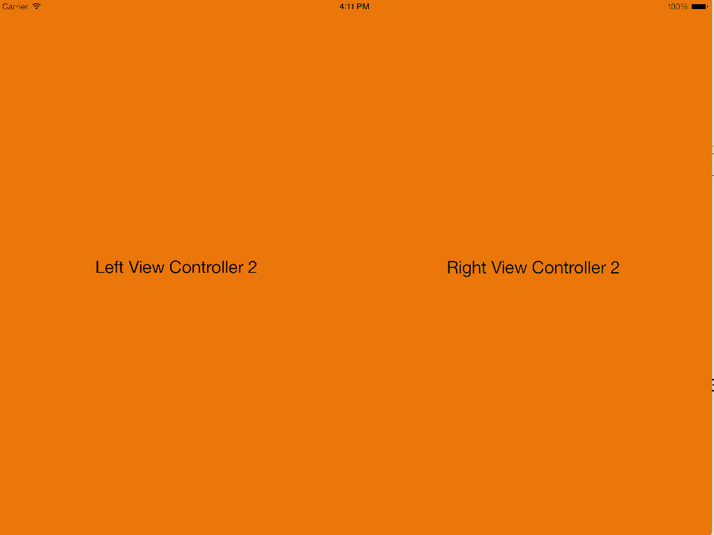

MILVerticalPagingSplitViewController
=======================

MILVerticalPagingSplitViewController is an easy-to-use specialized view controller for iOS that manages a split screen interface. In this interface, two view controllers are displayed at the same time on two halves of the screen, and each side can be swiped up or down to reveal a separate view controller on that half of the screen.

## Installation

Simple copy `MILVerticalPagingSplitViewController.swift` into your Xcode project.

## Usage

1. Create an instance of the `MILVerticalPagingSplitViewController`

1. View controllers that are to be displayed in the `SplitViewController` must have a `Storyboard ID` as that ID is used to instantiate the view controllers.

1. To populate the list of view controllers for each half of the `SplitViewController`, set the variables `leftViewControllers` and `rightViewControllers` to arrays of the Storyboard IDs wanted for each side:

        milVerticalPagingSplitVC.leftViewControllers = ["LeftViewController1", "LeftViewController2", "LeftViewController3"]
        milVerticalPagingSplitVC.rightViewControllers = ["RightViewController1", "RightViewController2", "RightViewController3"]

1. To indicate which view controller should be initially shown, set the variables `currentLeftVCIndex` and `currentRightVCIndex` to the index of the view controller's storyboard ID:

        milVerticalPagingSplitVC.currentLeftVCIndex = 0
        milVerticalPagingSplitVC.currentRightVCIndex = 1

In this example, the left half of the screen would initially display LeftViewController1, and the right half of the screen would display RightViewController2.  **The app will crash if these indices are outside the bounds of the array**

### Storyboard Version
|   |
|---|
|   |
|   |
|   |
|   |
|   |

## Requirements
* Currently, MILSplitVerticalPagingViewController is set up to work with iOS 8+.
* Designed for use on a horizontal iPad, however it should work on all devices and orientations.

## Author

Created by [Sean Saathoff](https://github.com/sean86) from designs provided by [Paul Roth](https://dribbble.com/paulroth)
at the [IBM Mobile Innovation Lab](http://www-969.ibm.com/innovation/milab/)

Contributed to / refactored by [Ruslan Ardashev](https://github.com/ruslan120101) in spare time / as a Swift learning exercise

## License

MILSplitVerticalPagingViewController is available under the Apache 2.0 license. See the LICENSE file for more info.
